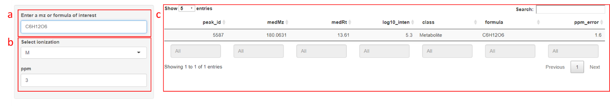
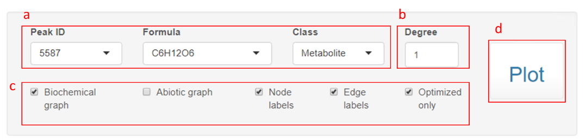
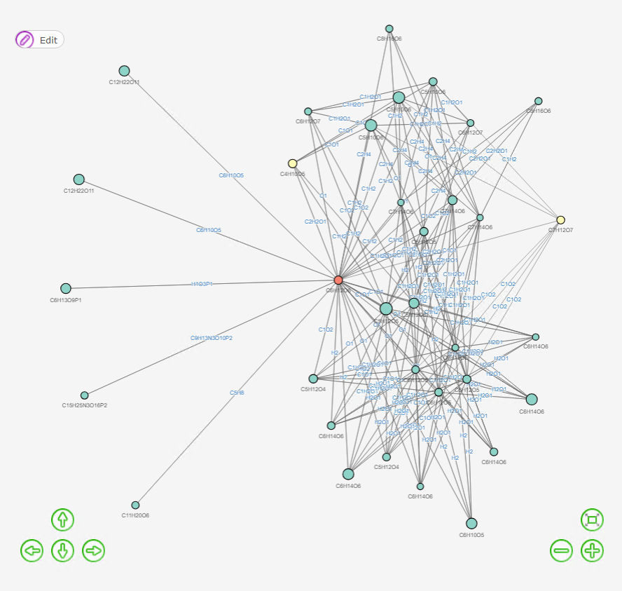
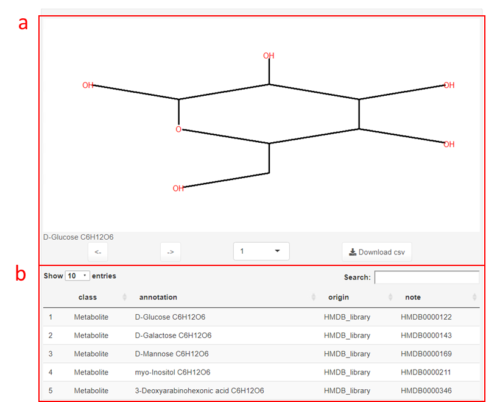

```{r setup, include=FALSE}
knitr::opts_chunk$set(echo = TRUE)
```

A primary goal of liquid chromatography-high resolution mass spectrometry (LC-MS)-based metabolomics is to identify all metabolites, but most LC-MS peaks remain unidentified. Here, we present a global network optimization approach, NetID, to annotate untargeted LC-MS metabolomics data. We consider all experimentally observed ion peaks together, and assign annotations to all of them simultaneously so as to maximize a score that considers properties of peaks (known masses, retention times, MS/MS fragmentation patterns). Global optimization results in accurate peak assignment and trackable peak-peak relationships in the output network. Applying this approach to yeast and mouse data, we identify 5 novel metabolites, including thiamine and taurine derivatives. Isotope tracer studies indicate active flux through these metabolites. Thus, NetID applies existing metabolomic knowledge and global optimization to annotate untargeted metabolomics data, revealing novel metabolites.   

NetID requires (1) a peak table containing m/z, RT and intensity from high-resolution mass spectrometry data. (2) a reference compound database, which we provide HMDB, YMDB, a lite version of PubChem (PubChemLite.0.2.0) and a subset of 47,101 biopathway related entries (PubChemLite_Bio) for user to choose. (3) a transformation table, which we assembled a list of 25 biochemical atom differences and 59 abiotic atom differences. NetID optionally use (4) a list of excel files containing MS2 fragmentation information (m/z and intensity) for peaks in the above peak table. (5) a list of known metabolites’ retention time, which we provide our in-house retention time list for demonstration. Users can customize the compound database, the transformation table and the retention time list following the user guide. 
Currently the algorithm is developed using Thermo Orbitrap instruments results. We anticipate the algorithm will work for other high mass accuracy data, such as TOF data, but parameters may need to be optimized for the best performance.  

Citation: https://www.biorxiv.org/content/10.1101/2021.01.06.425569v1  
Git-hub: https://github.com/LiChenPU/NetID

# Environment Setup

This section provides step-by-step instructions to set up the environment to run NetID algorithm in a local computer. A Windows system is recommended. Typical install time on a "normal" desktop computer is within a few hours.

## Software installation
* Install R, Rstudio, Rtools40, ILOG CPLEX Optimization Studio (CPLEX) and Git, preferably at default location.

    >**R**(version 4.0, 4.1 tested): <https://www.r-project.org/>  
    >**RStudio**: <https://rstudio.com/products/rstudio/download>  
    >**Rtools40**: <https://cran.r-project.org/bin/windows/Rtools/ow>  
    >**CPLEX**(version 12.8,12.10,20.10 tested): <https://www.ibm.com/academic/technology/data-science>  
    >**Git**: <https://git-scm.com/downloads>
    
## Code download

### Via Git (recommended)

1. Install **git** via <https://support.rstudio.com/hc/en-us/articles/200532077?version=1.3.1093&mode=desktop>

2. In Rstudio, go to `File` $\rightarrow$ `New project` $\rightarrow$ `Version control` $\rightarrow$ `Git`, enter <https://github.com/LiChenPU/NetID.git> for `URL`, select a subdirectory, and create project.

3. You should be able to see all files in place under your selected subdirectory. Use pull option to check for latest updates.

### Via Github

1. Go to website <https://github.com/LiChenPU/NetID>, hit the green `code` button, select download zip, and unzip files.

## Package dependency installation

Most of the dependent packages can be installed by running the R script `NetID_packages.R` in the `get started` folder. See **Troubleshooting** section for possible errors.

The package, **cplexAPI**, connecting R to CPLEX, requires additional installation steps.

1. Go to website: <https://cran.r-project.org/web/packages/cplexAPI/index.html>, look for `Package source`, and download `cplexAPI_1.4.0.tar.gz`. In the same page, look for `Materials`, a package installation guide can be found in the link `INSTALL`. 

2. Unzip the folder `cplexAPI` to the **desktop**, open subfolder `src`, follow the installation guide to modify the file `Makevars.win`.  
*Note*: Replace `\` in the `Makevars.win` file into `/` in order for R to recognize the path.  
    * For example, the `-I"${CPLEX_STUDIO_DIR}\cplex\include"` should be replaced with the path CPLEX_studio is installed, such as:  
    `-I"C:/Program Files/IBM/ILOG/CPLEX_Studio1210/cplex/include"`   
    * The `-L"${CPLEX_STUDIO_LIB}"` should be replaced with the path CPLEX_studio is installed, such as:  
    `-L"C:/Program Files/IBM/ILOG/CPLEX_Studio1210/cplex/bin/x64_win64"`

3. build package, 
    * In command line, change `${Username}` to the actual user name and run line below, 
    `R CMD build --no-build-vignettes --no-manual --md5 "C:\Users\${Username}\Desktop\cplexAPI"`  

    * Alternatively, you can run the lines below in Rstudio:  
    `setwd('C:/Users/${Username}/Desktop/cplexAPI')`
    `devtools::build(vignettes = FALSE)`

    a new package `cplexAPI_1.4.0.tar.gz` will be built under the default path (for example, `C:\Users\${Username}`)

    *Note*: You need to add R and Rtools40 to Environmental Variables PATH, with instruction provided at the end. 

4. In command line, run line below to install package.  
`R CMD INSTALL --build --no-multiarch .\cplexAPI_1.4.0.tar.gz`  
If you see `DONE (cplexAPI)`, then the package installation is successful.  
    * *Note*: if error occurs relating to `__declspec(dllimport deprecated)`, you need to go to `C:\Program Files\IBM\ILOG\CPLEX_Studio1210\cplex\include\ilcplex` (or other installation path), open the file `cpxconst.h`, go to the line indicated in the error message or search for `__declspec(dllimport deprecated)`, add `_` to `__declspec(dllimport deprecated)`, making it to `__declspec(dllimport_deprecated)`. Save file and repeat *step 4*.

5. To test if cplexAPI is installed properly and to take a short venture using CPLEX in R, refer to **Package cplexAPI – Quick Start** in <https://cran.r-project.org/web/packages/cplexAPI/index.html>.

# Using NetID
This section will use yeast negative-mode dataset and mouse liver negative-mode dataset as examples to walk through the NetID workflow.

* *Note 1: If other El-MAVEN version was used, check the “raw_data.csv” for the column number where the first sample is located, and specify that in the NetID_run_script.R file. For example, In El-MAVEN (version 7.0), first_sample_col_num is set at 15 as default. If El-MAVEN (version 12.0) is used, first_sample_col_num should be set at 16.*
* *Note 2: for more advanced uses, scoring and other parameters can be edited in NetID_function.R and NetID_run_script.R. Read the manuscript method section for detailed explanation on parameters.*

## Yeast negative-mode dataset

In the `Sc_neg` folder, file `raw_data.csv` is the output from **Elmaven** recording MS information, and is the input file for **NetID**. MS2 is not collected for this dataset.

### Running the code

1. Open `code folder` $\rightarrow$ `NetID_run_script.R`

2. In the `# Setting path #### section`, set work_dir as `"../Sc_neg/"`.

```
# Setting path ####
{
  setwd(dirname(rstudioapi::getSourceEditorContext()$path))
  source("NetID_function.R")
  
  work_dir = "../Sc_neg/"
  setwd(work_dir)
  printtime = Sys.time()
  
}
```

3. In the `# Read data and files #### section`, set filename as `"raw_data.csv"`, set MS2_folder as `""`.  
set `ion_mode` as `-1` if negative ionization data is loaded, and `1` if positive ionization data loaded.

```
# Read data and files ####
{
  Mset = list()
  # Read in files 
  Mset = read_files(filename = "raw_data.csv",
                    LC_method = "Hilic_25min_QE", 
                    ion_mode = -1 # 1 for pos mode and -1 for neg mode
                    )
  Mset = read_MS2data(Mset,
                      MS2_folder = "") # MS2
}
```

4. Keep all other parameters as default, and run all lines.

### Expected outputs
1.  In the console, error message should not occur. If optimization step is successful, you will see messages in the following format.

```
"Optimization ended successfull - integer optimal, tolerance - OBJ_value = 2963.71
(bestobjective - bestinteger) / (1e-10 + |bestinteger|) = 0.000048268"
95.74 sec elapsed
```

2. Three files will be generated in the `Sc_neg` folder. Expected run time on a "normal" desktop computer should be within an hour.  
    * `NetID_output.csv` contains the annotation information for each peak.  
    * `NetID_output.RData` contains node, edge and network information. The file will be used for network visualization in Shiny R app.  
    * `.RData` records the environmental information after running codes. The file is mainly used for development and debugging.

## Your own dataset

### MS1 dataset preparation

1.  File conversion. Use software **ProteoWizard40** (version 3.0.11392) to convert LC-MS raw data files (.raw) into mzXML format. A command line script specifies the conversion parameter. Assuming the raw data are in `D:/MS data/test`. Type in the scripts below.

```
D:
cd D:/MS data/test
"C:/Program Files/ProteoWizard/ProteoWizard 3.0.11392/msconvert.exe" 
*.raw --filter "peakPicking true 1-" --simAsSpectra --srmAsSpectra --mzXML 
```


If **ProteoWizard** is installed in location other than `C:/Program Files/ProteoWizard/ProteoWizard 3.0.11392/msconvert.exe`, specify your path to where you can find the `msconvert.exe` file.  
Expected outputs will be `.mzXML` files from `.raw` data.

2. **El-MAVEN (version 7.0)** is used to generate a peak table containing m/z, retention time, intensity for peaks. Detailed guides for peak picking can be found in <https://elucidatainc.github.io/ElMaven/faq/>.  
After peak picking and a peak table tab has shown up, click `export to CSV`. Choose `export all groups`. In the pop-up saved window, choose format `Groups Summary Matrix Format Comma Delimited`. Save to the desired path.

3. Under the `NetID` folder, create a new folder `NetID_test`, copy the csv file from *step 2* into the folder, and change the filename into `raw_data.csv`.


### MS2 dataset preparation

**NetID** currently utilizes targeted MS2 data for better MS2 quality, and will incorporate data-dependent MS2 data in the future.

1. Prepare MS2 inclusion list  
For targeted MS2 analysis, from the peak list generated in *step 1*, select the peaks (m/z, RT) that you want to perform MS2, and arrange them into multiple csv files that will serve as the inclusion lists to set up the PRM method on **Thermo QExactive** instrument. Instruction can be found in <https://proteomicsresource.washington.edu/docs/protocols05/PRM_QExactive.pdf>.  
*Note*: Arrange the parent ions so as to avoid to perform many PRMs at same time. An example is shown below with the start and End time set as RT-1.5 and RT+1.5 (min) to have good chromatogram coverage.  
```{r}
library(readr)
read_csv("example.csv")
```

2. Instrument setup  
Set up the **QExactive** instrument so that it contains both “Full MS” and “PRM” scan events. For PRM setup, use the above file as inclusion list to perform targeted MS2 analysis. We typically use the following setting for MS2 analysis: resolution 17500, AGC target 1e6, Maximum IT 500 ms, isolation window 1.5 m/z. For a total of 1500 parent ions and 15 parent ions for each method, it requires a total of 100 runs, or ~42 hours using a 25-min LC method.

3.  MS2 file conversion.  
**RawConverte**r (version 1.2.0.1, <http://fields.scripps.edu/rawconv/>) is used to convert the `.raw` file into `.mzXML` file that contains MS2 information. Keep the default parameters except setting `Environment Type` as `Data Independent`, and `Output Formats` as `mzXML`.

4. MS2 reading and cleaning.  
A matlab code is used for MS2 reading and cleaning, which can be found in **CodeOcean** as a published capsule (<https://codeocean.com/capsule/1048398/tree/v1>). The `csv` files from *1* paired with the MS2 data files in `mzXML` format from *3* are the required input data. Refer to capsule description and `readme.md` file for more details of how the code works. In Brief,  
    * Prepare filename. Filenames for both csv and mzXML files should be named as `prefixNNN`, where prefix is the given file name and NNN is the 3 digits number in continuous order (e.g. `M001.csv`, `M002.csv`,… and `M001.mzXML`, `M002.mzXML`,… in the `/data` folder).  
    * Duplicate the capsule to your own account so you can edit and use the capsule. Upload your own files and remove the previous files in `/data` folder.  
    * Specify the prefix and the range of numbers at the beginning section of the main code `Main_example.m`.  
    * Set the main code as file to run in Code Ocean using the dropdown menu next to main code.  
    * Click `reproducible run` to perform the batch processing.  
    * The resulting output files in `.xlsx` format with the same filenames will appear in the timeline. Each `xlsx` file contains multiple tabs of cleaned MS2 spectra. The names of the tabs correspond to the row numbers of the `csv` file specifying the individual parent peak information.
  
5. Save files to folders.  
Back to the `NetID_test` folder, create a new folder `MS2`, download all `xlsx` files from *4* into the folder.

### Running the code

1. Open `code` folder $\rightarrow$ `NetID_run_script.R`.

2. In the `# Setting path #### section`, set `work_dir` as `"../NetID_test/"`.

3. In the `# Read data and files ####` section,  
set `filename` as `raw_data.csv`, set `MS2_folder` as `MS2`.  
set `LC_method` to specify column to read for the retention time of known standards. (In folder `NetID` $\rightarrow$ `dependent` $\rightarrow$ `known_library.csv`, update the retention time info as needed.)  
set `ion_mode` as `-1` if negative ionization data is loaded, and `1` if positive ionization data loaded.

4. Keep all other parameters as default, and run all lines.

### Expected outputs

Similar to the `demo` file, the console will print out message indicating optimization step is successful, and three files `NetID_output.csv`, `NetID_output.RData` and `.RData` will be generated in the `NetID_test` folder

## Other Settings

### Compound librarys

#### Other provided librarys

**NetID** provides 4 librarys for the user to choose: **HMDB**, **YMDB**, **PubChem**, **PubChem Bio-pathway only**.

To select the desired database, change `HMDB_library_file = "../dependent/hmdb_library.csv"` to `../dependent/ymdb_library.csv`, `../dependent/pbcm_library.csv` or `../dependent/pbcm_library_bio.csv`.
```
  Mset = read_files(filename = "raw_data.csv",
                    LC_method = "Hilic_25min_QE", 
                    ion_mode = -1, # 1 for pos mode and -1 for neg mode
                    HMDB_library_file = "../dependent/hmdb_library.csv"
                    )
```

#### Design your own library

1. A workable library requires following columns.
```{r}
read_csv("../../dependent/hmdb_library.csv")
```

2. To build your own library, make a csv file in the same format as the one shown above, and set `HMDB_library_file = "../dependent/hmdb_library.csv"` to your desired directory in `NetID_run_script.R`.

### Modifying `emperical_rules.csv`

`emperical_rules.csv` can also be created or modifed to support specific biotransformation. A workable emperical_rules requires following columns.
    * `name` and `note` is not necessary.
    * `category` includes: `Biotransform`, `Natural_abundance`, `Adduct`, `Fragment` and `Radical`
    * `rbde` is calculated using the `formula_rbde` function of the package `lc8`
    * `direction` states the possible direction of transformation: `1` means from larger mass to smaller mass; `0` means the opposite; `-1` means both direction are possible.
    
```{r}
read_csv("../../dependent/empirical_rules.csv")
```

### Retention time list
#### Customize your own RT table 
1. In the dependent folder, open the `known_library_customized.csv` file
```{r}
read_csv("../../dependent/known_library_customized.csv")[1:5,]
```
2. Column `Name`, `formula` are required. Column `HMDB`, `SMILES` are optional. For each RT list (e.g. Hilic_25min_QE), record the retention time under the column. Multiple RT lists can be stored by adding additional columns. Empty retention time is allowed for a entry. 

#### Skip RT table 
Setting the LC_method = "No_RT". Then RT information will not be considered in the algorithm.
```
  Mset = read_files(filename = "raw_data.csv",
                    LC_method = "No_RT", 
                    ion_mode = -1, # 1 for pos mode and -1 for neg mode
                    HMDB_library_file = "../dependent/hmdb_library.csv"
                    )
```

### Score Setting

See Supplementary Note 2 of NetID paper for explanation 

# NetID Visualization

This section provides instruction to visualize and explore **NetID** output results in either **Cytoscape** software or interactive **Shiny R app**. After running **NetID** algorithm, it will export one `.R` and two `.csv `files (`cyto_node.csv` and `cyto_edges.csv`), storing the nodes and edges of the output network.

## Cytoscape

0. What is **Cytoscape**
For more info regarding what is **Cytoscape**, check <https://cytoscape.org/what_is_cytoscape.html>.

1. install **Cytoscape**
Download **Cytoscape** (<https://cytoscape.org/download.html>) and follow installation instruction to install onto your computer.

2. Load the example **NetID** output into **Cytoscape**  
    * Run **Cytoscape**, click `import network from file system`, and load `cyto_edges.csv`, set `edge_id` column as the `key`, set `node1 `as `source node`, set `node2` column as `target node`, and the rest columns as `edge attribute`.  
    * Click `import table from file`, load `cyto_node.csv`, set `node_id` column as the `key`, and the rest columns as `node attribute`. 
    * Select `subnetwork`, set `styles`, and explore the network with various functionalities inside **Cytoscape**.
    
3. Explore in Cytoscape  
<http://manual.cytoscape.org/en/stable/index.html> provides all you need to know about exploring in **Cytoscape**. (This writer knew little about this cool software, so all he could give was this link and *may the Force be with you*.)

4. Export  
The network as well as the curated subnetworks can be exported for future analysis or sharing with others. An example network file `example.cys` is included along with the two `.csv` files, which is created using **Cytoscape** version 3.8.2


## Shiny App

This part provides instruction to visualize and explore **NetID** output results in the interactive **Shiny R app**. A 21-inch or larger screen is recommended for best visualization.

### Runing Shiny App

1. Open `code` folder $\rightarrow$ `R_shiny_App.R`.

2. In the `# Read in files #### section`, set datapath as `../Sc_neg/`

3. Keep all other parameters as default, and run all lines.

4. A Shiny app will pop up.

### Searching peaks of interest
1. On the left panel, you can enter a m/z or a formula to search your peak of interest. For example, 180.0631 or C6H12O6 will automatically update the data table on the right. Enter 0 to restore full list for the data table. 

2. Change ionization and ppm window to adjust calculated m/z.

3. On the right, you can explore the peak list in an interactive data table, including global text search on top right, specifying ranges for numeric column or searching text within character columns, ranking each column etc.



### Network Visualization

1. Peak ID, formula and class determines the center node for the network graph. Peak ID will be automatically updated by the first line in the data table if a m/z or formula is given. Alternatively, you can manually enter Peak ID. 

2. The degree parameter controls how far the network expands from the center node. Degree 1 means only nodes directly connected to the center node will be shown and degree 2 means nodes connected to degree 1 will be shown, etc. 

3. Biochemical graph shows biochemical connections. Abiotic graph shows abiotic connections. Node labels and Edge labels determines if the graph show node or edge labels. Optimized only determines whether to show only the optimal annotations or all possible annotations in the network. 
4. When setting parameters, hit plot to see the network graph.



5. A sample network graph is shown below (a different center node may give less complicated graph). You may edit the nodes or edges (top left), move figures with the arrow buttons (bottom left), and zoom in/out or center figure (bottom right). 



6. You can use the “Download plot” button to download a html webpage to visualize the network graph independent of the Shiny app, and the “Download csv” button to download the information of the nodes in the network. The download buttons will appear after hitting the plot button. Note: edits within the Shiny app will not go into the html file.

### Possible structures exploration

A figure + data table is provided to explore structures of the selected node in the network graph.

1. The figure shows the chemical structure of the annotated metabolites. If the node is annotated as a putative metabolite, only the known parts of the putative metabolite will be shown.   
Scroll left or right, or select the entry number, to visualize different annotations. Right click and select to save image.

2. In the data table, class has 3 possible entries: Metabolite if it is documented in database such as HMDB library; Putative metabolite if it is transformed from a metabolite through a biotransformation edge; and Artifact if it is transformed by an abiotic edge.  
Use the download button to download the data table




# Troubleshooting

## Failing to install package `lc8`

Reinstall the packages `devtools` and `digest`.

## Cannot find `cplexAPI` even if the installation seems successful

Check **R** version used in **RStudio** to see if `cplexAPI` is installed under the same R version library. Which R library `cplexAPI` goes to depends on the R path specified in `Environment Variables`.

## Add **R** to `PATH`
1. Go to `Environment Variables`:   
search `PATH` in `windows` $\rightarrow$ open `edit Environment Variables` $\rightarrow$ `Environment Variables`
or  
`control panel` $\rightarrow$ `system and security` $\rightarrow$ `System` $\rightarrow$ `Advanced system Settings` (on your left) $\rightarrow$ `Advanced` $\rightarrow$ `Environment Variables`

2. In the lower Panel select the `Path Variable` and select `Edit`, add the R path (`C:\Program Files\R\R-4.0.3\bin\x64`, if installed at default location) to the `Path Variable`.

3. You may need to restart computer for the R path to take effect.

## Add **Rtools40** to `PATH`
1. Add the path `C:\Rtools\bin` to the `Path Variable `in `Environment Variables`

2. Run the line in **R**:   
`writeLines('PATH="${RTOOLS40_HOME}\\usr\\bin;${PATH}"', con = "~/.Renviron")`  
Use the line below in R console to check for successfully adding Rtools40  
`Sys.which("make")`  
Expected output: `## "C:\\rtools40\\usr\\bin\\make.exe`


